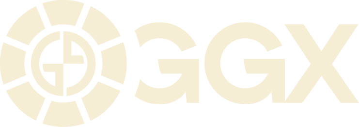
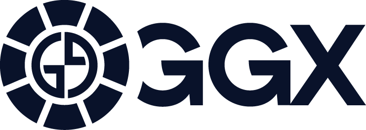

  
  

### What is the GGx Chain?

GGx chain is a general purpose, interchain consensus platform. GGx is a sovereign Proof of Stake blockchain backed by professional validators, with EVM, WASM and Zero-Knowledge capabilities. This makes the GGx chain an ideal choice for settlement.

### Why is the GGx Chain?

GGx chain is an interchain relay platform. GGx chain is also a smart contract platform, utilizing a hybrid virtual machine. GGx chain's hybrid virtual machine allows users to program in Solidity as well as any general purpose programming language that can be compiled into the WASM (e.g. Rust, Javascript).

We provide base layer relays, modern security techniques and zero-knowledge precompiles, providing the richest environment for dapps development, especially for dapps that require cross-chain settlement.
