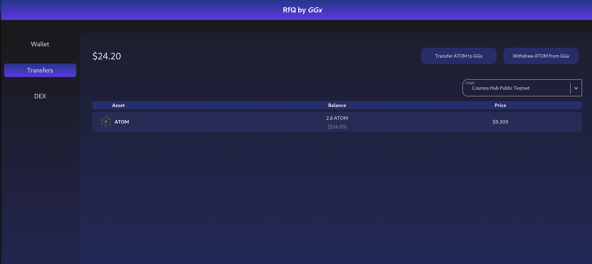

# Request for Quote DEX

Our decentralized Request for Quote (RFQ) system provides users a seamless and secure platform to transfer assets onto our chain and engage in peer-to-peer trading. Users can move assets onto our blockchain from various external sources using the Bitcoin bridge, IBC (Inter-Blockchain Communication), and the Ethereum Schnorr bridge. Once assets are on-chain, users can initiate RFQs and directly engage in trading activities with other users. The decentralized nature of the system ensures transparency, immutability, and trustless transactions, offering a robust and efficient solution for users seeking a decentralized marketplace for asset trading.

## Wallet page

The Wallet Page on the GGx Network displays user assets within the GGx network.
The page has the following functionality:

* Deposit/withdraw assets from the dex pallet
* Choose an active GGx account.
* See balances and estimated prices using the Centralized Exchange of your portfolio

  

## Transfers Page

The Transfers page is our core for bridging assets onto and out of the GGx network.
The functionality allows users to transfer assets easily using various protocols.

Currently, we support the following protocols:

* [x] IBC
* [ ] BTC bridge
* [ ] Ethereum Schnorr bridging

  

### IBC transferring

The IBC transfer requires an active relayer that will transmit messages using channel information.
You can find the latest channel information for your interested chain in Discord/or our IBC documentation.
You need a `Keplr wallet` extension to submit an IBC transfer deposit.

Steps to transfer assets to GGx:

* Select asset for transfer
* Click `Transfer ... to GGx.`
* Choose destination GGx account. Please be aware that you're required to have a Polkadot wallet extension to be able to work with the GGx chain. You also have to have a GGx token for gas operations.
* Select the channel number from Discord/or our docs. We will automate this functionality later.
* Enter the amount to transfer
* Click the `IBC Deposit` button and confirm in the keplr extension.

You can similarly withdraw tokens.

  

## DEX functionality

The DEX page allows users to make/take orders on our platform easily. The view has two categories:

* Taker form
* Maker form
* User orders with the ability to cancel

The maker form allows user to:

* Specify the token and it's amount for swap
* Specify the token and it's amount to receive
* Order expiration time
The form will display small analytics and comparisons with centralized exchange.

  

The taker form allows the user to:

* See the order book and choose the bucket price
* Swap with specified bucket pricing

  

