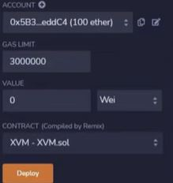

# How to Deploy Solidity Smart Contracts

You can use the Remix IDE to deploy Solidity contracts on the GGX chain network. The Remix IDE is an Integrated Development Environment (IDE) specifically designed for developing and testing smart contracts on the EVM blockchain. It provides a browser-based interface that allows developers to write, compile, deploy, and debug smart contracts written in Solidity, the programming language for the EVM.

You can deploy the Solidity contract via Remix IDE through the following steps:

1. Go to the Remix IDE website - <https://remix.ethereum.org>

2. Add GGX chain Network to your wallet and choose the corresponding injected provider. Please see the [Metamask wallet installation instructions](../wallets/metamask.md). 

3. Create your `.sol` contract in the file explorer

4. Go to Deploy & Run Transactions

   

5. Press **deploy** - authorization pop-up from a wallet should appear

   

6. Authorize the transaction. In case you have a sufficient amount of tokens to pay, the gas fee deployed contract will appear below.
