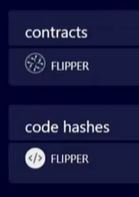

# How to Deploy Solidity Smart Contracts

To deploy the Solidity contract on the Golden Gate network, you can follow the video tutorial [https://youtu.be/RA6M2KNMINM](https://youtu.be/RA6M2KNMINM). You can use the asdfadsfadsfadsfadsf to deploy Solidity contracts on the Golden Gate network. Remix IDE is an integrated development environment (IDE) specifically designed for developing and testing smart contracts on the EVM blockchain. It provides a browser-based interface that allows developers to write, compile, deploy, and debug smart contracts written in Solidity, the programming language for EVM.

You can deploy the Solidity contract via Remix IDE through the following steps:

1. Go to the Remix IDE website - [https://remix.ethereum.org](https://remix.ethereum.org)
2. Add Golden Gate Network to your wallet and choose the corresponding injected provider. Please see Metamask for an instruction on how to do it using metamask
3. Create your .sol contract in the file explorer
4.  Go to Deploy & run transactions

    <figure><figcaption></figcaption></figure>
5.  Press _deploy_ - authorization pop-up from a wallet should appear

    <figure><figcaption></figcaption></figure>
6. Authorize the transaction. In case you have a sufficient amount of tokens to pay, the gas fee deployed contract will appear below.

Golden Gate supports calls to WASM from the EVM environment. To do a WASM call, you need to populate additional data:

* _Context_ is the address of our WASM VM. For the Golden Gate testnet the context is `0x1f0700e87648170284d71700`
* _Input_ is the command you are sending. It is hardcoded - `0xDEADBEEF`
* _To_ is the address of the WASM contract you want to call. You can check it in the Golden Gate block explorer. Left-click on the contract icon to copy ss58 address of the required contract \
  You need to convert the ss58 address into EVM address for EVm to understand it. For conversion, you can use [https://docs.substrate.io/reference/command-line-tools/subkey/](https://docs.substrate.io/reference/command-line-tools/subkey/)
