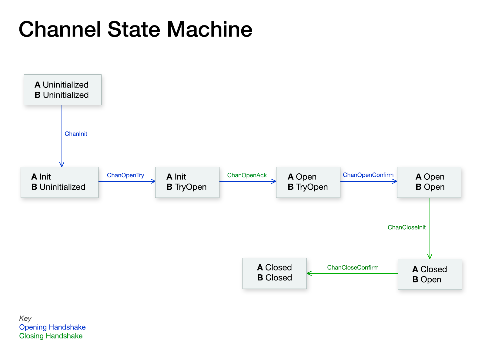

## IBC information and ICS20 interface

#### Channel lifecycle management

<div align="center">
  
</div>

### ICS20 interface

#### 1. ink! interface
```rust
        /// Token transfer. This allows us to transfer exactly one native token.
        pub fn execute_transfer(
            &self,
            msg: TransferMsg,
            amount: Amount,
            sender: Addr,
        ) -> Result<Response, Error> ;


        /// Return the port ID bound by this contract.
        pub fn query_port(&self) -> PortResponse ;
```

#### 2. PSP37 interface
(open branch ink! ERC-1155: Multi Token Standard for Substrate's contracts pallet)

```rust
/// Contract module that provides a basic implementation of multiple token types.
/// A single deployed contract can include any combination of fungible tokens,
/// non-fungible tokens, or other configurations (e.g., semi-fungible tokens).
#[openbrush::trait_definition]
pub trait PSP37 {
    /// Returns the number of tokens of the token type `id` owned by `account`.
    ///
    /// If `id` is `None`, it returns the total number of tokens owned by `owner`.
    #[ink(message)]
    fn balance_of(&self, owner: AccountId, id: Option<Id>) -> Balance;

    /// Returns the total number of tokens of type `id` in the supply.
    ///
    /// If `id` is `None`, it returns the total number of tokens.
    #[ink(message)]
    fn total_supply(&self, id: Option<Id>) -> Balance;

    /// Returns the amount of `id` token that `owner` allows `operator` to withdraw.
    /// If `id` is `None`, it returns the allowance `Balance::MAX` for all tokens of `owner`.
    #[ink(message)]
    fn allowance(&self, owner: AccountId, operator: AccountId, id: Option<Id>) -> Balance;

    /// Allows `operator` to withdraw the `id` token from the caller's account
    /// multiple times, up to the `value` amount.
    /// If this function is called again, it overwrites the current allowance with `value`.
    /// If `id` is `None`, it approves or disapproves the operator for all tokens of the caller.
    ///
    /// An `Approval` event is emitted.
    #[ink(message)]
    fn approve(&mut self, operator: AccountId, id: Option<Id>, value: Balance) -> Result<(), PSP37Error>;

    /// Transfers the `value` of the `id` token from the `caller` to `to`.
    ///
    /// On success, a `TransferSingle` event is emitted.
    ///
    /// # Errors
    ///
    /// Returns a `TransferToZeroAddress` error if the recipient is a zero account.
    ///
    /// Returns a `NotAllowed` error if the transfer is not approved.
    ///
    /// Returns an `InsufficientBalance` error if the `caller` doesn't have enough balance.
    ///
    /// Returns a `SafeTransferCheckFailed` error if `to` doesn't accept the transfer.
    #[ink(message)]
    fn transfer(&mut self, to: AccountId, id: Id, value: Balance, data: Vec<u8>) -> Result<(), PSP37Error>;

    /// Transfers `amount` tokens of the token type `id` from `from` to `to`. Additional `data` can also be passed.
    ///
    /// On success, a `TransferSingle` event is emitted.
    ///
    /// # Errors
    ///
    /// Returns a `TransferToZeroAddress` error if the recipient is a zero account.
    ///
    /// Returns a `NotAllowed` error if the transfer is not approved.
    ///
    /// Returns an `InsufficientBalance` error if `from` doesn't have enough balance.
    ///
    /// Returns a `SafeTransferCheckFailed` error if `to` doesn't accept the transfer.
    #[ink(message)]
    fn transfer_from(
        &mut self,
        from: AccountId,
        to: AccountId,
        id: Id,
        amount: Balance,
        data: Vec<u8>,
    ) -> Result<(), PSP37Error>;
}
```

#### 3. Struct
```rust
    pub struct Addr(String);

    pub struct Coin {
        pub denom: String,
        pub amount: u128,
    }

    pub struct Cw20Coin {
        pub address: String,
        pub amount: u128,
    }

    pub struct TransferMsg {
        /// The local channel on which to send the packets.
        pub channel: String,
        /// The remote address to which the data should be sent.
        /// Do not use HumanAddress as it might have a different Bech32 prefix than we use,
        /// and it cannot be validated locally.
        pub remote_address: String,
        /// The duration (in seconds) for which the packet remains alive. If not specified, use default_timeout.
        pub timeout: Option<u64>,
        /// An optional memo to add to the IBC transfer.
        pub memo: Option<String>,
    }


    pub enum Amount {
        Native(Coin),
        Cw20(Cw20Coin),
    }

    impl Amount {
        pub fn from_parts(denom: String, amount: u128) -> Self {
            if denom.starts_with("cw20:") {
                let address = denom.get(5..).unwrap().into();
                Amount::Cw20(Cw20Coin { address, amount })
            } else {
                Amount::Native(Coin { denom, amount })
            }
        }

        pub fn cw20(amount: u128, addr: &str) -> Self {
            Amount::Cw20(Cw20Coin {
                address: addr.into(),
                amount: amount,
            })
        }

        pub fn native(amount: u128, denom: &str) -> Self {
            Amount::Native(Coin {
                denom: denom.to_string(),
                amount: amount,
            })
        }
    }

    impl Amount {
        pub fn denom(&self) -> String {
            match self {
                Amount::Native(c) => c.denom.clone(),
                Amount::Cw20(c) => "cw20:".to_owned() + c.address.as_str(),
            }
        }

        pub fn amount(&self) -> u128 {
            match self {
                Amount::Native(c) => c.amount,
                Amount::Cw20(c) => c.amount,
            }
        }

        /// Convert the amount into u64.
        pub fn u64_amount(&self) -> Result<u64, Error> {
            Ok(self.amount().try_into().unwrap())
        }

        pub fn is_empty(&self) -> bool {
            match self {
                Amount::Native(c) => c.amount == 0,
                Amount::Cw20(c) => c.amount == 0,
            }
        }
    }
```
#### 4. Errors
```rust
pub enum Error {
        /// StdError
        StdError,
        /// PaymentError
        PaymentError,
        /// AdminError
        AdminError,
        /// #[error("Channel doesn't exist: {id}")]
        NoSuchChannel { id: String },
        /// #[error("Didn't send any funds")]
        NoFunds {},
        /// #[error("Amount larger than 2**64, not supported by ics20 packets")]
        AmountOverflow {},
        /// #[error("Only supports channel with ibc version ics20-1, got {version}")]
        InvalidIbcVersion { version: String },
        /// #[error("Only supports unordered channel")]
        OnlyOrderedChannel {},
        /// #[error("Insufficient funds to redeem voucher on channel")]
        InsufficientFunds {},
        /// #[error("Only accepts tokens that originate on this chain, not native tokens of remote chain")]
        NoForeignTokens {},
        /// #[error("Parsed port from denom ({port}) doesn't match packet")]
        FromOtherPort { port: String },
        /// #[error("Parsed channel from denom ({channel}) doesn't match packet")]
        FromOtherChannel { channel: String },
        /// #[error("Cannot migrate from different contract type: {previous_contract}")]
        CannotMigrate { previous_contract: String },
        /// #[error("Cannot migrate from unsupported version: {previous_version}")]
        CannotMigrateVersion { previous_version: String },
        /// #[error("Got a submessage reply with unknown id: {id}")]
        UnknownReplyId { id: u64 },
        /// #[error("You cannot lower the gas limit for a contract on the allow list")]
        CannotLowerGas,
        /// #[error("Only the governance contract can do this")]
        Unauthorized,
        /// #[error("You can only send cw20 tokens that have been explicitly allowed by governance")]
        NotOnAllowList,
    }

```
#### References
[IBC Interfaces for CosmWasm Contracts](https://github.com/CosmWasm/cosmwasm/blob/main/IBC.md)

[Contracts Semantics](https://github.com/CosmWasm/cosmwasm/blob/main/SEMANTICS.md)

[Introduction to CosmWasm](https://github.com/CosmWasm/cosmwasm/blob/main/README.md)

[Channel and Packet Semantics](https://github.com/cosmos/ibc/tree/main/spec/core/ics-004-channel-and-packet-semantics)

[PSP37 Protocol](https://github.com/w3f/PSPs/blob/master/PSPs/psp-37.md)

[PSP37 Trait](https://github.com/Brushfam/openbrush-contracts/blob/main/contracts/src/traits/psp37/psp37.rs)
