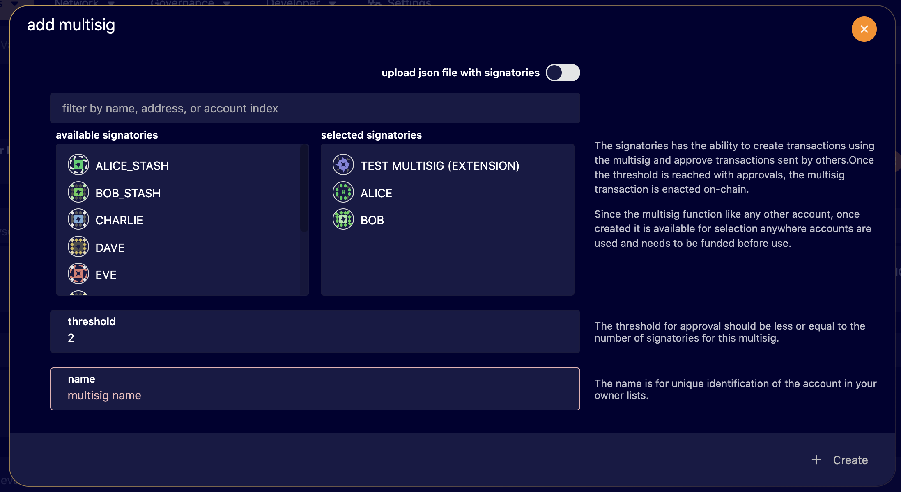
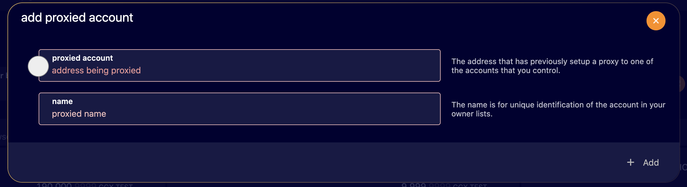

## Key Generation Using GGX Explorer

The GGX Explorer UI is a web-based interface for interacting with Substrate-based chains, including GGX.
It allows users to import keys from a QR code, generate Multisig accounts and create proxied accounts.

#### Security considerations

The GGX Explorer UI is a web-based interface. It's an open-source project, and highly audited. But running anything in a browser often increases security risks. For this reason, it is advisable to have unnecessary extensions disabled when working with the keys in UI.

#### Creating a Multisig Account

1. Open the GGX Explorer UI and navigate to the "Accounts" section.
2. Sign up with an extension or add an account by scanning a QR-code. 
3. Click on the "+ Multisig" button on the top right section of the interface.

  

4. A popup appears where you can set the name of the account and the number of signatories and choose from available accounts on the left side. You can optionally upload a JSON file with the public keys of the signatories.

  

5. The "threshold" controls the minimum amount of signatories required to approve a transaction.
6. Click on the "Create" button to create the Multisig account.

Please note, that a Multisig account doesn't have a private key. Instead, it is identified by a combination of its signatories' addresses and a threshold, which represents the minimum number of signatories required to approve a transaction.

The identifier (or address) of a multisig wallet is derived from the addresses of the signatories and the threshold using a deterministic function. This identifier can be calculated by anyone who knows the addresses of the signatories and the threshold, but it does not provide any control over the multisig wallet.

#### Proxied Accounts

A proxied account is a special type of account that allows another account to make transactions on its behalf. This is useful for delegating the management of an account to another account, for example, a multisig account.

You can create a proxied account in the Explorer by navigating to the Accounts section and clicking the button on the top right of the interface.

  

Follow the instructions in the popup to create a proxied account.

  

#### Vanity Generator

You can genereate a vanity address using the GGX Explorer UI. A vanity address is an address that includes a specific string for better readability. For example, you can generate an address that includes "GGX" or "Alice" words.

1. Open the [GGX Explorer UI](https://testnet.sydney.ggxchain.io/) and navigate to the "Accounts" section.
2. Sign up with an extension or add an account by scanning a QR-code.
3. Click on the "Vanity Generator" in the Accounts section.
4. Enter the desired prefix and click on the "Generate" button.
5. The generated addresses will start to appear in the list of accounts. It may take some time depending on the length of the prefix string.
6. Hit "Save" button and save the keys securely.
