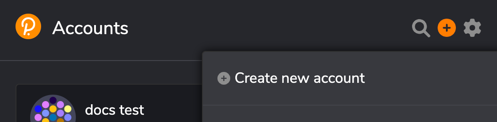
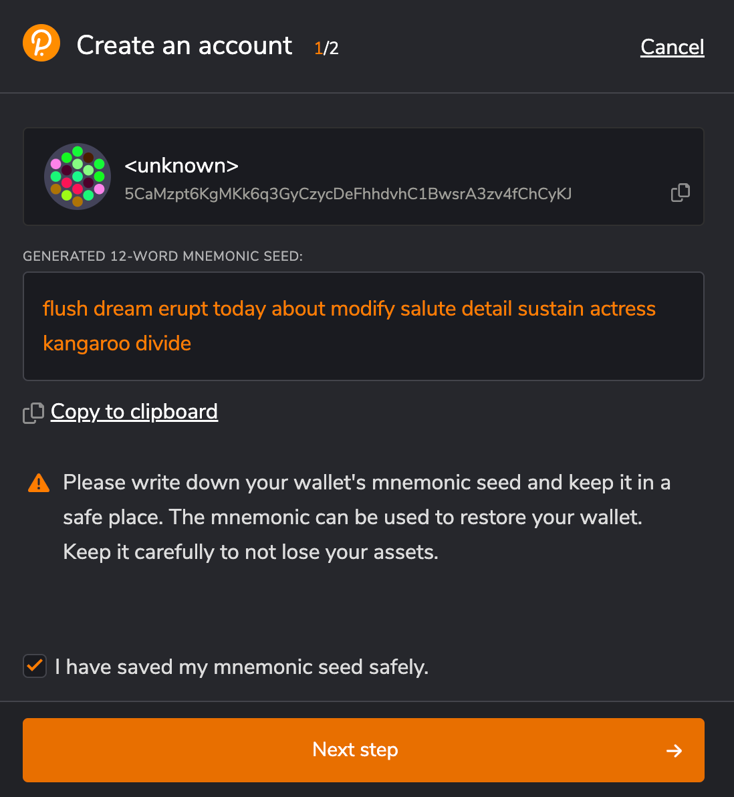
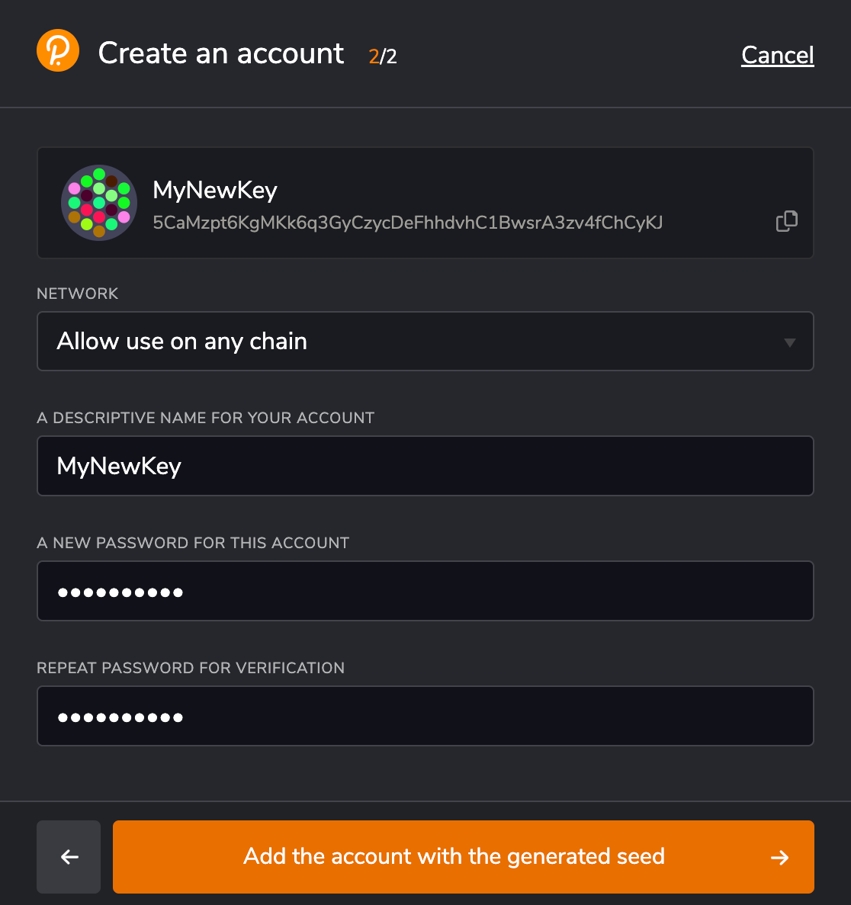

## Key Generation using Polkadot.js Extension

The Polkadot.js extension is a browser extension that provides a user-friendly interface for interacting with Substrate-based chains, including GGX. It allows users to create key pairs with ease.

1. Install the Polkadot.js extension in your web browser (compatible with Chrome and Firefox).
2. Click on the extension icon, "+" button  and select "Create new account."

  

3. Safely store the generated recovery phrase (mnemonic phrase) and account details.

  

4. On the next step set a name for the account and a password.

  

5. The newly created account will appear in the list. The displayed format depends on the preferences set in the extension.

You might want to convert the key format to match default network prefix by using Developer -> Utilities -> Convert Address in the [Explorer UI](https://testnet.sydney.ggxchain.io/).

**Note:** For security reasons, it is advisable to use this method only for accounts with limited access. For running a validator node use [node-based methods](node-create-keys.md).

It is not possible to use this extension for creation or management of EVM-based keys.
