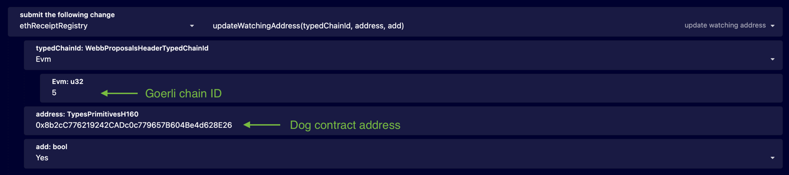
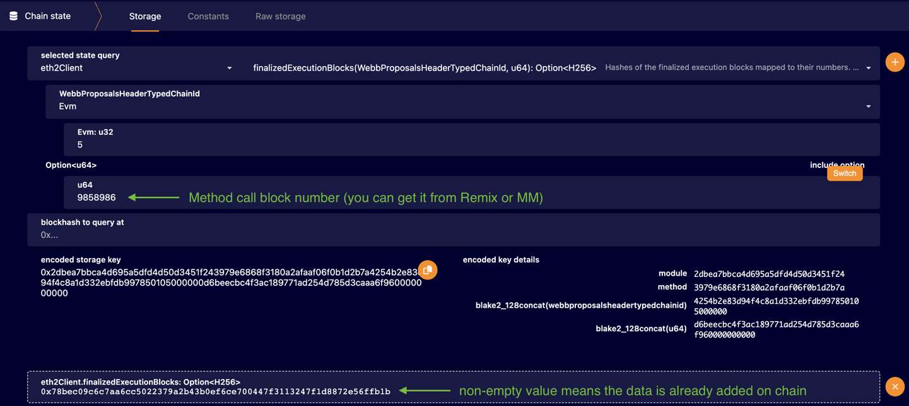
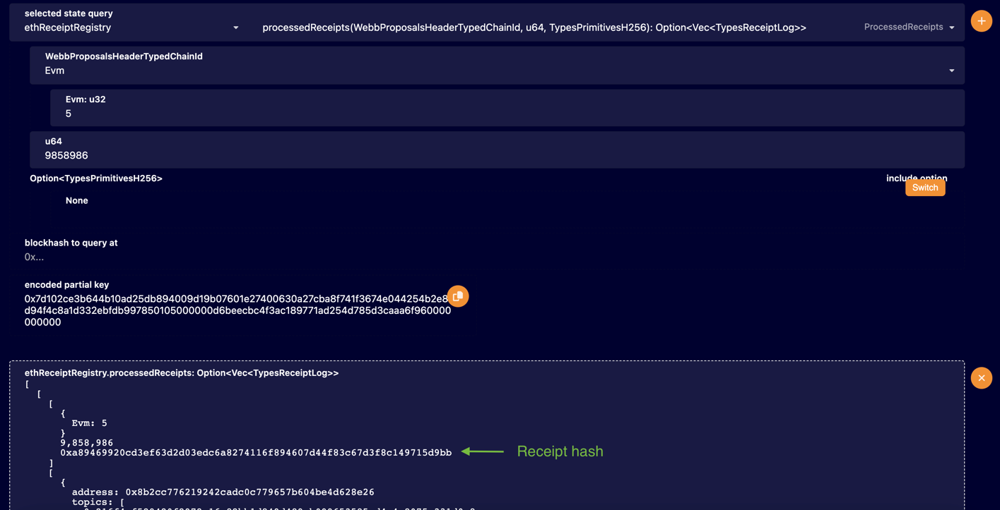
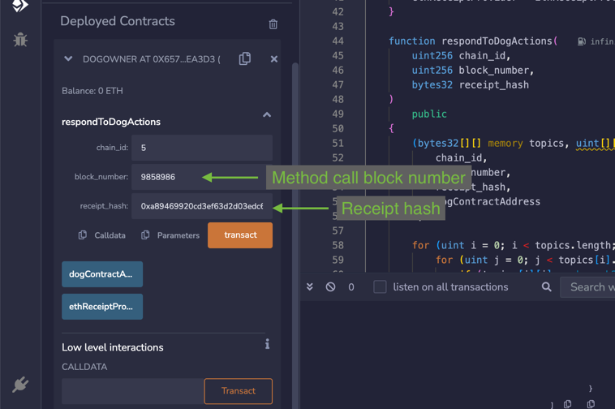
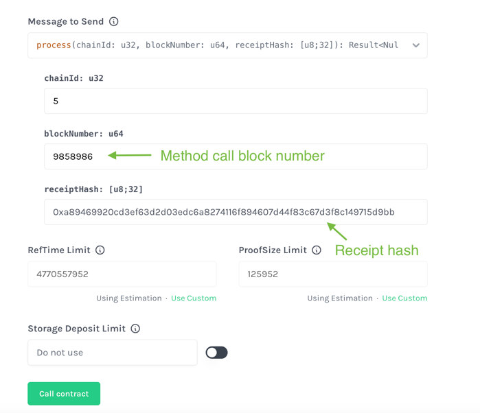

## ETH Light Client & Relayer setup and usage example

**For now ETH Light Client is integrated only with our development blockchain Brooklyn, later Sydney and mainnet will support it too.**  

Before starting register on https://www.infura.io/ and get your API key.

### Node setup:

```bash
git clone https://github.com/ggxchain/ggxnode.git --branch eth-light-client
cd ggxnode
```

Navigate to https://beaconstate-goerli.chainsafe.io/ and get the hash of Latest Finalized Block.  
In file `./eth-init.toml`, edit the `init_block_root` field with this value.

Then execute following commands in `ggxnode` folder to run the node:

```bash
cargo build --release -p ggxchain-node --features "brooklyn"
export ETH1_INFURA_API_KEY="https://goerli.infura.io/v3/<INFURA_API_KEY>"
./target/release/ggxchain-node --dev --light-client-relay-config-path eth-relay.toml --light-client-init-pallet-config-path eth-init.toml
```

### Relayer setup:

```bash
git clone https://github.com/ggxchain/transaction-receipt-relayer.git --branch relayer-integration
cd transaction-receipt-relayer
```

In file `./helios.toml` update field `execution_rpc` with Infura API Key

Then execute following commands in `transaction-receipt-relayer` folder to run the relayer:

```bash
cargo build --release -p eth-transaction-receipt-relayer
RUST_LOG=info ./target/release/eth-transaction-receipt-relayer --network goerli --database db --helios-config-path helios.toml --substrate-config-path ggxchain-config.toml
```

### Usage example:

1. Select Goerli network in MetaMask.  
2. Open [Remix](https://remix.ethereum.org/).  
3. Create a contract with this code:  

```
// SPDX-License-Identifier: MIT
pragma solidity ^0.8.0;

interface EthReceiptProvider {
    function logs_for_receipt(
        uint256 chain_id,
        uint256 block_number,
        bytes32 receipt_hash,
        address contract_addr
    )
        external
        returns (
            bytes32 [][] calldata,
            uint[][] calldata
        );
}


// Ethereum contract
contract Dog {
    event Bark(string message);
    event TailWag(string message);

    function bark() public {
        emit Bark("Woof! Woof!");
    }

    function wagTail() public {
        emit TailWag("The dog is happy and wagging its tail!");
    }
}

// GGXChain EVM contract that reacts on Dog contract
contract DogOwner {
    EthReceiptProvider public ethReceiptProvider;
    address public dogContractAddress;
    event Response(string message);

    constructor() {
        dogContractAddress = 0xA90af795c551c6a62A079828c4b3360f69e18f6C;
        ethReceiptProvider = EthReceiptProvider(0x0000000000000000000000000000000000009999);
    }

    function respondToDogActions(
        uint256 chain_id,
        uint256 block_number,
        bytes32 receipt_hash
    ) 
        public 
    {
        (bytes32[][] memory topics, uint[][] memory _data) = ethReceiptProvider.logs_for_receipt(
            chain_id,
            block_number,
            receipt_hash,
            dogContractAddress
        );

        for (uint i = 0; i < topics.length; i++) {
            for (uint j = 0; j < topics[i].length; j++) {
                if (topics[i][j] == keccak256("Bark(string)")) {
                    emit Response("Bad boy");
                } else if (topics[i][j] == keccak256("TailWag(string)")) {
                    emit Response("Good boy");
                }
            }
        }
    }
}
```

 4.Select Injected Provider - MetaMask in the list of environments.  
 5.Deploy Dog contract to Goerli network.  
 6.In the [Block Explorer](https://explorer.ggxchain.io/?rpc=ws%3A%2F%2F127.0.0.1%3A9944#/) navigate to Developer -> Sudo.  
 7.Call the method with following parameters:  
<div >
  
</div>
 8.In Remix call any contract method. <br>
 9.Wait until the block with the method call is added on GGX Chain (could take a while, 15+ mins):  
<div >
  
</div>
 10.Now you can call this method to get receipt hash:
<div >
  
</div>

### EVM Contract usage:
1.Switch to Local network in MetaMask (RPC URL: http://127.0.0.1:9944)  
2.Deploy DogOwner contract (in constructor update `dogContractAddress` field with appropriate value)  
3.Call `respondToDogActions` method:
<div >
  
</div>
4.Check the Remix logs, it should contain either 'Bad boy' or 'Good boy' message.

### WASM Contract usage:
1.In `transaction-receipt-relayer/chain-extension/contract` build the DogOwner contract:
```bash
cargo contract build
```
2.Deploy the contract `./target/ink/dog_owner_contract.contract` to the chain (pass the Dog address as constructor parameter) using [Block Explorer](../how-to-guides/how-to-deploy-rust.md) or [Contracts UI](https://contracts-ui.substrate.io/).  
3.Call the `process` method:    
    
4.Check the Explorer logs, event `contracts.ContractEmitted` should contain either 'Bad boy' or 'Good boy' message. 
[//]: # (<div>)

[//]: # ()

[//]: # (</div>)