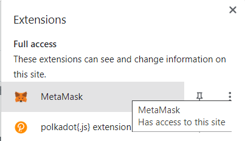
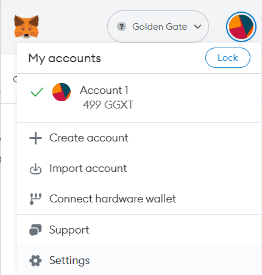
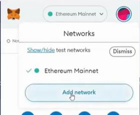
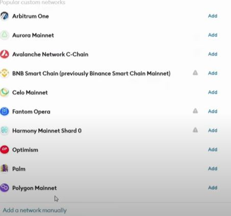
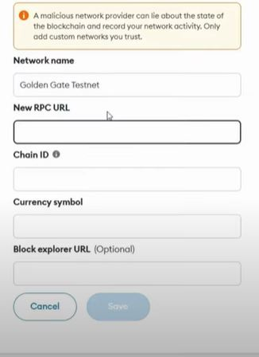

# Metamask

MetaMask is a popular cryptocurrency wallet and browser extension that enables users to interact with decentralized applications (dApps) on the EVM blockchains. It acts as a bridge between a user's web browser and an EVM blockchain, allowing them to manage their accounts, store and transfer ERC-20 tokens, and interact with smart contracts.

To install MetaMask, follow these steps:

1. Open your preferred web browser (Chrome, Firefox, or Brave) and visit the MetaMask website at <https://metamask.io/>.

2. On the MetaMask website, click on the "Get Chrome Extension" (or "Get Firefox Extension" or "Get Brave Extension") button, depending on the browser you are using. In Chrome, it should look like this

    

3. You will be redirected to the browser's extension store. Click on the "Add to Chrome" (or "Add to Firefox" or "Add to Brave") button to start the installation process.

4. A pop-up window will appear, asking for confirmation to add the extension. Click "Add extension" to proceed.

5. Once the extension is added, you will see the MetaMask icon in your browser's toolbar (usually located at the top right corner). Click on the MetaMask icon to launch the extension.

6. The first time you launch MetaMask, you will be presented with the Terms of Service. Read through the terms, and if you agree, click "Accept" to continue.

7. Next, you will be prompted to create a new MetaMask wallet or import an existing one. Follow the on-screen instructions to set up your wallet. This includes creating a strong password and securely storing your seed phrase.

After setting up your wallet, you will have access to your EVM accounts and can start using MetaMask to interact with dApps, manage tokens, and perform EVM transactions.

Remember to keep your MetaMask password and seed phrase secure. The seed phrase is crucial for wallet recovery and should be stored offline in a safe place.

Note: The installation steps may vary slightly depending on the browser you are using. Make sure to follow the specific instructions for your browser.

To use MetaMask with one of the Golden Gate networks, you will need to add the respective network into metamask. You can do that using our video instruction <https://youtu.be/0RSAoHbn6C8> or follow the steps:

1.  Open the MetaMask extension by clicking on the MetaMask icon in your browser's toolbar.

    

2.  In the MetaMask interface, click on the account avatar at the top right corner and select "Settings" from the dropdown menu

    

3. In the Settings menu, select the "Networks" tab.

4.  Scroll down to the "Networks" section and click on the "Add Network" button.

    

5.  Scroll to the bottom and choose "Add a network manually"

    

    A form will appear where you can enter the details of the custom network.

    

    * Network Name: Golden Gate Testnet
    * New RPC URL: https://testnode.ggxchain.io
    * Chain ID: 888866
    
    Once you have filled in the required details, click the "Save" button to add the custom network to MetaMask.
    
    The custom network will now be available in the MetaMask interface. You can switch between networks by clicking on the network dropdown at the top of the MetaMask interface and selecting the desired network.
