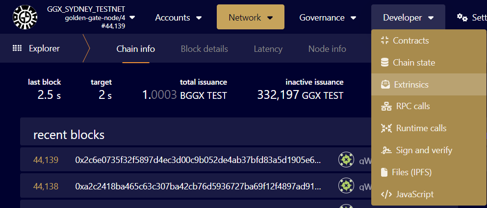
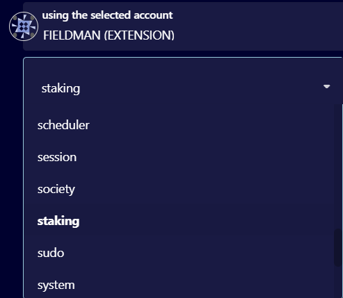
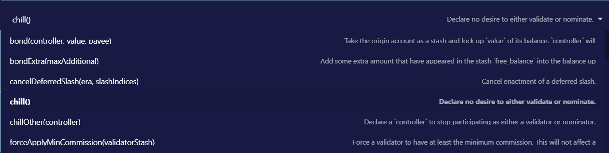

# How to Pause Staking

The Golden Gate validator may opt to pause staking (or *chill*) whenever he or she wants to prevent participation in staking for the upcoming era but does not want to unstake funds (e.g. when there is maintenance planned).

Validator can do that by calling the `chill` extrinsic in the [staking pallet](https://paritytech.github.io/substrate/master/pallet\_staking/pallet/enum.Call.html#variant.chill) using following the steps:

1.  Go to Developer &rarr; Extrinsics

    

2.  Choose the validator account you want to chill

    

3.  Under the **submit the following extrinsic** dropdown menu choose the "staking" extrinsic

    

4.  Choose "chill" command

    

5.  Submit the transaction.