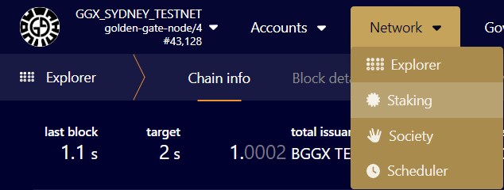
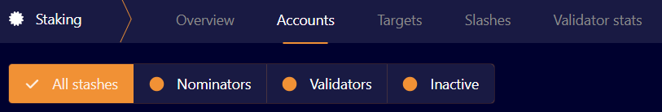
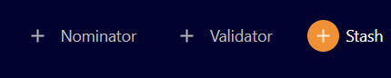

# How to Stake GGXT Tokens

To stake GGXT tokens in the Golden Gate Sydney testnet, please follow the steps:

1. Acquire tokens. Please check out our [Sydney Validator Program](../sydney-testnet/sydney-validator-programme.md "Sydney Validator Program").
2. Create two substrate accounts. You can do that using [PolkadotJS](../../developer-documentation/wallets/polkadotjs.md).
3. Distribute tokens between the controller account and the stash account. You will need at least 1000 GGXT tokens in the stash to stake.
4. After [setting up a validator node](how-to-setup-a-validator-node.md) and receiving tokens you can stake using our block explorer.
5. Go to Network &rarr; Staking

    

6. Go to Accounts. You can see **Nominators** and **Validators** there.

    

7.  You can bond tokens using **+Stash** button. You will need to populate the following fields:

    * **Stash account** - Select the stash account created in step 2.
    * **Controller account** - Select the controller account created in step 2. This account will also need a small amount of GGXT to pay for controlling transactions.
    * **Value bonded** - How much GGXT from the Stash account you want to bond/stake. Note that withdrawing any bonded amount requires the duration of the unbonding period.
    * **Payment destination** - The account where the rewards from validating are sent.

    Once everything is filled in properly, click `Bond` and sign the transaction with your Stash account.

Make sure not to bond all your GGXT balance since you cannot pay transaction fees from your bonded balance.

#### Session keys

To get your node nominated, please follow the steps:

1.  Get your node session key. Assuming you are running using docker, you can do that running the command:

    ```bash
    docker exec -it goofy_curie curl -H "Content-Type: application/json" -d '{"id":1, "jsonrpc":"2.0", "method": "author_rotateKeys", "params":[]}' http://localhost:9933
    ```

2. Go to Network &rarr; Staking
3. Go to Accounts. Click **Set Session Key** next to stash account created earlier.
4. Enter the output from `author_rotateKeys` from step 2 and click "Set Session Key".
5. Authorize the transactions. Now others can nominate your node.
6. Go to Network &rarr; Staking
7. Go to Accounts. As before, you can see **Nominators** and **Validators** there
8. You can bond tokens using **+Stash** button, nominate a validator using **+Validator** button and add a Nominator using **+Nominator** button

    