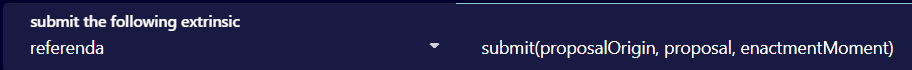

# Sydney bug bounty porgramme

The Sydney bug bounty programme is an initiative by the Golden Gate team to engage web3 developers and enthusiasts in securing the Golden Gate network for a reward in GGXT tokens.

The scope of the programme is the Golden Gate Sydney testnet.&#x20;

**How to apply**

To apply for our bug bounty programme contact us at info@ggxchain.io specifying "Bug bounty" in the subject. Please, note that KYC may be required.

**Bug categories**

We define two bugs categories for the programme:

* Critical bugs - bugs that can lead to loss of funds more than 35% of the currently staked amount.
* Crucial bugs - bugs that can lead to network halt, network stall for more than an hour, transactions censoring, or loss of funds less than 35% of the currently staked amount\

**Submission**

To submit your bug, use the proposal in our Sydney block explorer submitting your code using referenda extrinsic. You can do that by following the steps:

*   Go to Developer-->Extrinsics

    <figure><figcaption></figcaption></figure>
*   &#x20;Choose referenda extrinsic and submit proposal command&#x20;

    <figure><figcaption></figcaption></figure>

#### Validation

The proposal will be validated through the standard Golden Gate voting procedure

#### Rewards

We offer 500000 GGXT for Critical bugs and 100000GGXT for Crucial bugs.&#x20;
